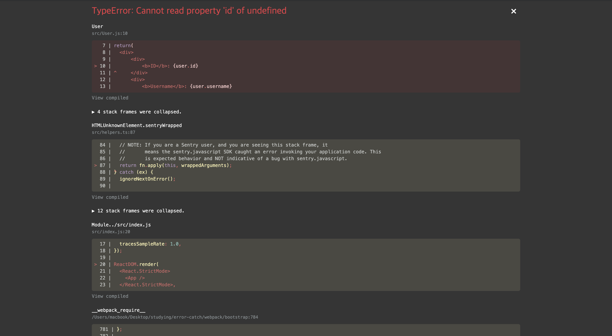

# veloport와 함께하는 모던 리액트

## 1장 - 리액트 입문

### componentDidCatch로 Error Handling 및 Monitoring 하기

> **Error Handling과 Monitoring이 필요한 이유**

- Error Handling을 위한 예외처리를 해주지 않으면, 에러화면이 송출되어 사용자에게 불필요한 에러 정보를 제공한다.
- Error Monitoring은 예외처리에 의한 에러상황을 통해 어떤 곳에서 에러가 발생했는지를 로그를 통해 확인해서, 개발자가 개선할 수 있도록 한다.

<br>

아래는 user라는 props를 인자로 받는 User 컴포넌트를 렌더링 할때, <br>
해당 props를 지정해주지 않고, default 값도 지정해 주지 않아 에러가 발생하는 예제이다. <br>

```javascript
// src/User.js
import React from "react";

function User({ user }) {
  // 실제로 컴포넌트를 설계할 때는 다음과 같이 예외 처리를 해주고,
  // props의 default값을 설정해주어야 한다.
  // 다만, 해당 작업을 빠트렸을 경우나 혹은 예외적인 JavaScript 오류에 대한
  // 예외처리를 위해서 Error Boundary를 사용한다.
  //if (!user) return null;
  return (
    <div>
      <div>
        <b>ID</b>: {user.id}
      </div>
      <div>
        <b>Username</b>: {user.username}
      </div>
    </div>
  );
}

export default User;
```

```javascript
// src/App.js
import React from "react";
import User from "./User";

function App() {
  const user = {
    id: 1,
    username: "ss-won",
  };
  return (
    <div>
      <User />
      <b>example 🐰</b>
    </div>
  );
}

export default App;
```

실제 렌더링 되는 localhost 서버로 접속하면, 다음과 같은 에러 화면이 뜨고 User 컴포넌트 및 이후 App에서 렌더링 하는 내용들은 볼 수 없다.

<br><hr>

### 그래서,

**React에서는 컴포넌트 함수 내부의 JavaScript 오류를 감지하고, 오류를 기록하며, 충돌이 발생한 컴포넌트 트리를 대체하는 UI를 표시하기 위해 `Error Boundary`라는 개념을 사용** 한다. <br>
Error Boundary는 클래스 컴포넌트 내에 `static getDerivedStateFromError()` 또는 `componentDidCatch()`를 정의하면 된다. 두 생명주기(getDerivedStateFromError or componentDidCatch) 내에서 state를 갱신하게 되면 하위 트리 내에 처리 되지 않은 JavaScript 오류를 발생시키고 대체 UI를 표시한다.
<br><br>

> **static getDerivedStateFromError**

```javascript
static getDerivedStateFromError(error)
```

- 해당 생명주기 메소드는, 자식 컴포넌트에서 오류가 발생했을 때 호출된다.

```javascript
class ErrorBoundary extends React.Component {
  constructor(props) {
    super(props);
    this.state = { hasError: false };
  }

  static getDerivedStateFromError(error) {
    // state를 갱신하여 다음 렌더링에서 대체 UI를 표시합니다.
    return { hasError: true };
  }

  render() {
    if (this.state.hasError) {
      // 별도로 작성한 대체 UI를 렌더링할 수도 있습니다.
      return <h1>Something went wrong.</h1>;
    }

    return this.props.children;
  }
}
```

- 매개변수로 error를 받고 갱신한 state값을 반드시 리턴해주어야 하며, render 단계에서 대체 UI를 표시할 수 있다. <br>

  👉🏻 **단, 해당 생명주기 메소드는 render 단계에서 호출되기 때문에, side effect를 발생시키면 안된다. 해당 경우에는 componentDidCatch를 사용한다.**
  <br><br>

> **componentDidCatch**

```javascript
componentDidCatch(error, info);
```

- 하위 자식 컴포넌트에서 오류가 발생했을 때 호출되며, 두 개의 인자를 받는다.
  1. error : 발생한 오류 객체
  2. info : 해당 오류가 발생한 컴포넌트 정보인 `componentStack 키`를 갖고 있는 객체 <br>
     **👉🏻 컴포넌트 트리에서 오류가 발생한 컴포넌트를 추적 가능**
- componentDidCatch 메소드는 Commit 단계(DOM에 직접 접근 가능한)에서 작동하기 때문에, getDerivedStateFromError와 달리 side effect(오류 로그 기록 등)를 지정할 수 있다.

```javascript
class ErrorBoundary extends React.Component {
  constructor(props) {
    super(props);
    this.state = { hasError: false };
  }

  static getDerivedStateFromError(error) {
    // state를 갱신하여 다음 렌더링에서 대체 UI를 표시합니다.
    return { hasError: true };
  }

  componentDidCatch(error, info) {
    // Example "componentStack":
    //   in ComponentThatThrows (created by App)
    //   in ErrorBoundary (created by App)
    //   in div (created by App)
    //   in App
    logComponentStackToMyService(info.componentStack);
  }

  render() {
    if (this.state.hasError) {
      // 별도로 작성한 대체 UI를 렌더링할 수도 있습니다.
      return <h1>Something went wrong.</h1>;
    }

    return this.props.children;
  }
}
```

**👉🏻 단, render 메소드가 이미 발생한 후의 상태이기 때문에, 대체 UI를 제어하기 어렵다.(setState를 통해 가능하지만 release 버전에서는 불가능) 이 경우에는 static getDerivedStateFromError를 사용해서 대체 UI를 제어해준다.**

아래 예제는 위의 오류 예제에서 Error Boundary 컴포넌트를 적용해, 오류 상황에 대체 UI를 출력하고 에러 모니터링을 해주는 것이다.

```javascript
// src/ErrorBoundary.js
import React, { Component } from "react";
import * as Sentry from "@sentry/react";

class ErrorBoundary extends Component {
  state = {
    error: false,
  };

  componentDidCatch(error, info) {
    // 오류 로그를 출력한다.
    console.log("에러가 발생했습니다.");
    console.log({
      error,
      info,
    });
    // 대체 UI 출력을 위해 setState로 state를 제어한다.
    this.setState({
      error: true,
    });

    // production 모드에서는 컴포넌트 스택 추적을 사용하면 안되기 때문에,
    // 해당 모드에서는 Sentry라는 오류 추적 핸들러 프로그램으로 해당 오류를 보내
    // 에러를 핸들링 및 모니터링 한다.
    if (process.env.NODE_ENV === "production") {
      Sentry.captureException(error, { extra: info });
    }
  }

  render() {
    if (this.state.error) {
      return <h1>에러 발생!</h1>;
    }
    return this.props.children;
  }
}

export default ErrorBoundary;
```

```javascript
// src/App.js
import React from "react";
import ErrorBoundary from "./ErrorBoundary";
import User from "./User";

function App() {
  const user = {
    id: 1,
    username: "ss-won",
  };
  return (
    <div>
      <ErrorBoundary>
        <User />
      </ErrorBoundary>
      {/* error boundary에 속하지 않은 부분은 그냥 출력된다 */}
      <b>example 🐰</b>
    </div>
  );
}

export default App;
```

## Reference

<https://react.vlpt.us/basic/26-componentDidCatch-and-sentry.html> <br>
<https://ko.reactjs.org/docs/react-component.html#componentdidcatch> <br>
<https://ko.reactjs.org/blog/2017/07/26/error-handling-in-react-16.html>
<br>

[👈🏻PREV](https://github.com/ss-won/veloport-react/blob/master/Ch1/17.md) |
[NEXT👉🏻](https://github.com/ss-won/veloport-react) <br>
[돌아가기](https://github.com/ss-won/veloport-react)
