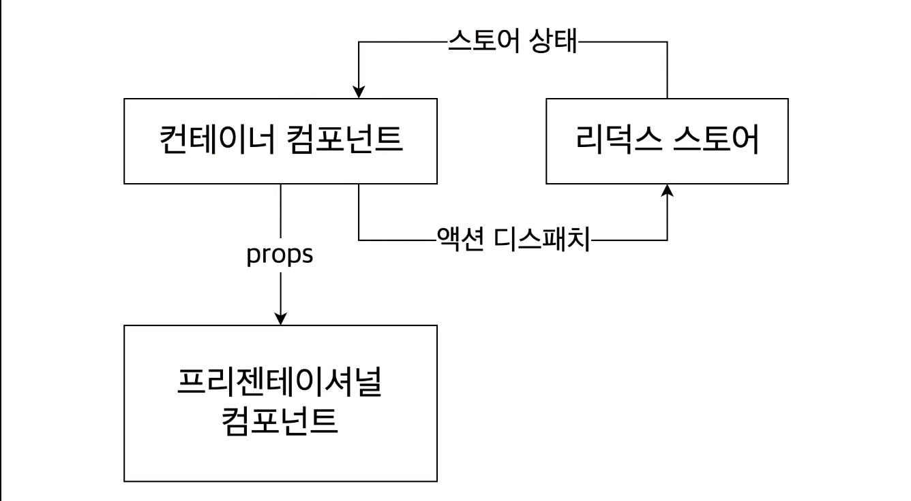

# veloport와 함께하는 모던 리액트

## 6장 - Redux

### Ducks Pattern을 이용한 Redux 모듈 구현하기 - 1️⃣ Counter

> **Ducks Pattern이란?** <br>

- Ducks은 actions와 action types와 reducers를 하나의 파일에 나란히 선언하는 모듈러 패턴이다.
- Ducks 패턴에 의하면, 모듈은 다음과 같은 조건을 충족해야 한다.
  1. **reducer() 함수는** 반드시 **export default로 export** 해야한다.
  2. **action creators는 반드시 함수로 export** 해야 한다.
  3. **action은** 반드시 npm-module-or-app/reducer/ACTION_TYPE에 있는 **형식을 지켜서 작성해야 한다.**
  4. 만약 외부 리듀서가 참조해야 하거나 재활용 라이브러리라면 **action types는 UPPER_SNAKE_CASE로 export** 해야한다.

출처 : [Matthew Holman - What is Redux Ducks?](https://medium.com/@matthew.holman/what-is-redux-ducks-46bcb1ad04b7)

> **Redux 모듈 만들기** <br>

```javascript
// src/modules/counter.js

// action type 선언
// ducks pattern에서 action type 앞에는 접두사를 붙임
// action type의 상수명칭은 UPPER_SNAKE_CASE로 작성함
const SET_DIFF = `counter/SET_DIFF`;
const INCREASE = `counter/INCREASE`;
const DECREASE = `counter/DECREASE`;

// action creator 함수 선언
// action creator 함수명은 Camel Case로 작성한다.
export const setDiff = (diff) => ({ type: SET_DIFF, diff });
export const increase = () => ({ type: INCREASE });
export const decrease = () => ({ type: DECREASE });

// 초기 상태값 선언
const initialState = {
  number: 0,
  diff: 1,
};

// reducer 함수 선언
// reducer 함수는 반드시 export default로 export 해준다.
export default function counter(state = initialState, action) {
  switch (action.type) {
    case SET_DIFF:
      return {
        ...state,
        diff: action.diff,
      };
    case INCREASE:
      return {
        ...state,
        number: state.number + state.diff,
      };
    case DECREASE:
      return {
        ...state,
        number: state.number - state.diff,
      };
    default:
      return state;
  }
}
```

만약, 여러개의 모듈을 관리한다면 modules 폴더에 각 모듈을 구현하고, root 모듈로 모든 모듈을 결합해서 export 해준다.<br>
👉🏻 폴더별로 관리하는 것이 필수적이지는 않다.

```javascript
// src/modules/index.js
import { combineReducers } from "redux";
import counter from "./counter";
import todos from "./todos";

// combineReducers로 구현한 모듈들을 모두 결합해서
// rootReducer로 만들어준다.
const rootReducer = combineReducers({
  counter,
  todos,
});

export default rootReducer;
```

> **Presentational과 Container Components 구현** <br>

- **Presentational Components** - Counter Component

```javascript
//  src/components/Counter.js
import React from "react";

// 모든 내부 상태 및 data는 props로 받아온다.
function Counter({ number, diff, onIncrease, onDecrease, onSetDiff }) {
  const onChange = (e) => {
    onSetDiff(parseInt(e.target.value, 10));
  };

  return (
    <div>
      <h2>{number}</h2>
      <input type="number" value={diff} onChange={onChange} />
      <button onClick={onIncrease}>+</button>
      <button onClick={onDecrease}>-</button>
    </div>
  );
}

export default Counter;
```

- **Container Components** - CounterContainer Component

```javascript
import React from "react";
import Counter from "../components/Counter";
import { useSelector, useDispatch } from "react-redux";
import { increase, decrease, setDiff } from "../modules/counter";

function CounterContainer() {
  // state : redux의 현재 상태
  const { number, diff } = useSelector((state) => ({
    number: state.counter.number,
    diff: state.counter.diff,
  }));
  const dispatch = useDispatch();

  // action 객체를 dispatch 적용해준다.
  const onIncrease = () => dispatch(increase());
  const onDecrease = () => dispatch(decrease());
  const onSetDiff = (diff) => dispatch(setDiff(diff));

  // redux로 업데이트 된 현 상태 및 dispatch 함수들을 props로 전달한다.
  return (
    <Counter
      number={number}
      diff={diff}
      onIncrease={onIncrease}
      onDecrease={onDecrease}
      onSetDiff={onSetDiff}
    />
  );
}

export default CounterContainer;
```

구현된 해당 모듈과 컴포넌트는 아래와 같은 흐름으로 동작하고 있다.<br>



Presentational Component는 명칭과 맞게, 보이는 컴포넌트 내부 UI 요소만을 고려한 컴포넌트이다. redux 창시자에 의하면 Presentational Component는 다음과 같은 특징을 가진다.

- 어떻게 보일까에 대해 집중한다.
- 내부에 프리젠 테이션 및 컨테이너 구성 요소를 모두 포함 할 수 있으며 일반적으로 일부 DOM 마크 업 및 자체 스타일이 있다.
- 종종 this.props.children을 통해 봉쇄를 허용한다.
- Flux actions나 stores 같은 앱의 나머지 부분에 대한 의존성이 없다.
- 데이터가 로드되고 변경되는 방식을 지정하지 않아야 한다.
- props를 통해서만 데이터와 콜백을 받아온다.
- 자체 상태를 거의 갖지 않는다.(데이터가 아닌 UI 상태)
- state, lifecycle hooks, 또는 최적화가 필요하지 않은 경우 함수형 컴포넌트로 작성된다.
- Examples: Page, Sidebar, Story, UserInfo, List.
  <br>

Container Component도 명칭에 맞게, 항위 컴포넌트를 감싸 업데이트 된 state를 하위 컴포넌트에 props로 전달해주는 컴포넌트이다. 마찬가지로 redux 창시자의 말에 의하면 Container Component는 다음과 같은 특징을 가진다.

- 어떻게 동작하는지에 집중한다.
- 내부에 프리젠 테이션 및 컨테이너 구성 요소를 모두 포함 할 수 있지만 일반적으로 일부 래핑 div를 제외하고 자체 DOM 마크 업이 없으며 스타일이 없다.
- 데이터와 행위(함수)를 presentational 또는 다른 container 컴포넌트에 제공한다.
- Flux의 actions를 호출하고 이를 presentational 컴포넌트에 대한 콜백으로 제공한다.
- 데이터 소스로 사용되는 경향이 있어 상태 저장이 자주 발생한다. (stateful)
- 수동으로 작성하는 대신 React Redux의 connect(), Relay의 createContainer(), Flux Utils의 Container.create()와 같은 고차원 컴포넌트를 사용하여 생성된다.
- Examples: UserPage, FollowersSidebar, StoryContainer, FollowedUserList.
  <br>

해당 특징에 대한 내용에는 의역이 포함되어 있으니, [원문](https://medium.com/@dan_abramov/smart-and-dumb-components-7ca2f9a7c7d0)을 참고하시길 바랍니다.

## Reference

- 벨로퍼트와 함께하는 모던 리액트 - 6장 리덕스 모듈 만들기 <https://react.vlpt.us/redux/04-make-modules.html>
- 벨로퍼트와 함께하는 모던 리액트 - 6장 카운터 구현하기 <https://react.vlpt.us/redux/05-counter.html>
- Matthew Holman - What is Redux Ducks? <https://medium.com/@matthew.holman/what-is-redux-ducks-46bcb1ad04b7>
- Dan Abramov - Presentational and Container Components <https://medium.com/@dan_abramov/smart-and-dumb-components-7ca2f9a7c7d0>
  <br>

[👈🏻PREV](https://github.com/ss-won/veloport-react/blob/master/Ch6/3.md) |
[NEXT👉🏻](https://github.com/ss-won/veloport-react/blob/master/Ch6/5.md) <br>
[돌아가기](https://github.com/ss-won/veloport-react)
